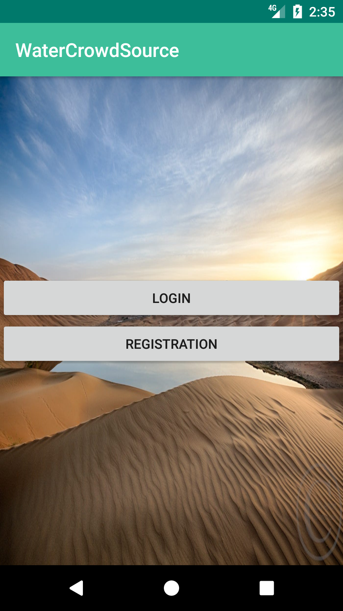
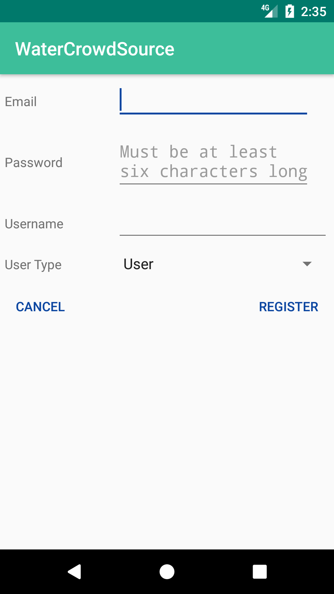
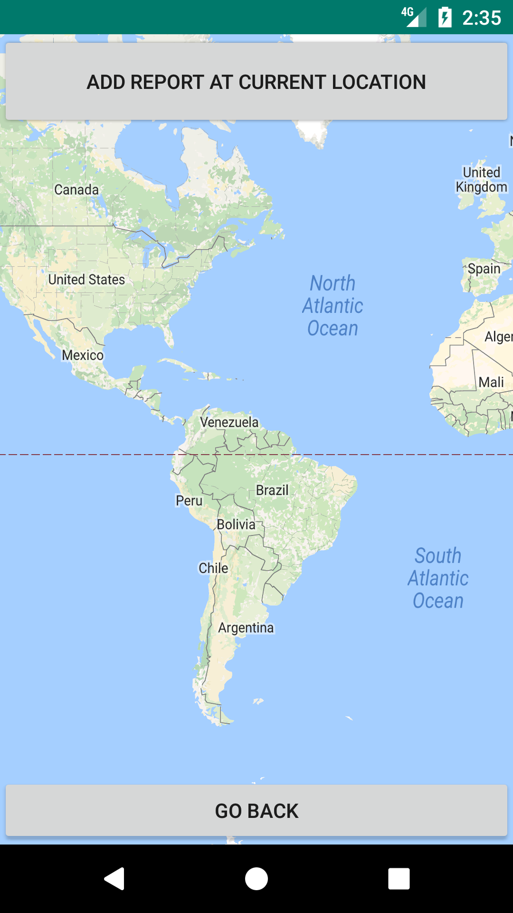
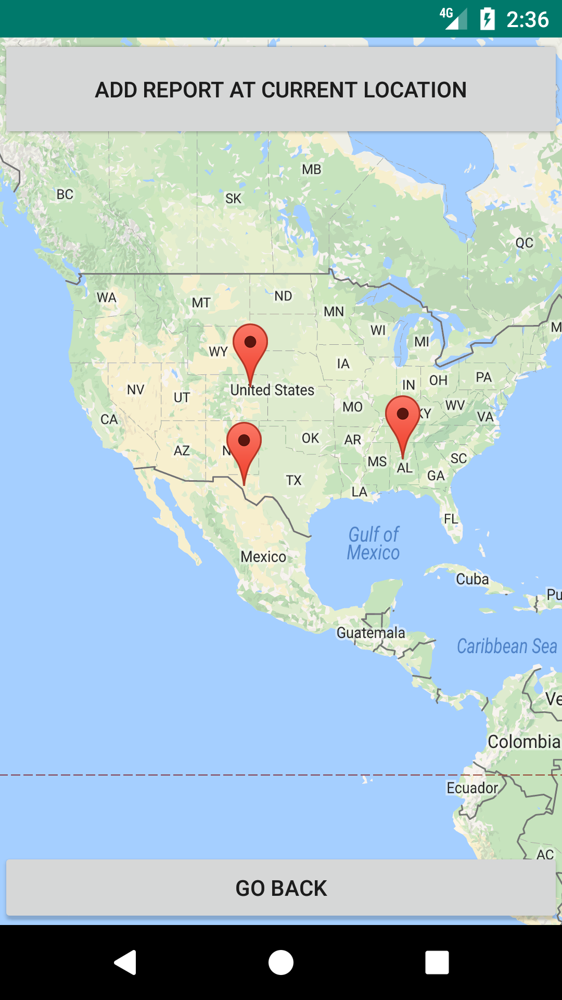

# WaterSource
CS2340 Group Project : An Android application that lets users know where clean water is available in developing countries through a crowdsourced system.
This application utilizes the firebase online database, and supports different responsibilities and privileges that users can have. Responsibilities include worker, manager, administrator and user. 

Welcome Screen:

Login Screen:

Before adding a location of clean water:

After adding a location of clean water:

